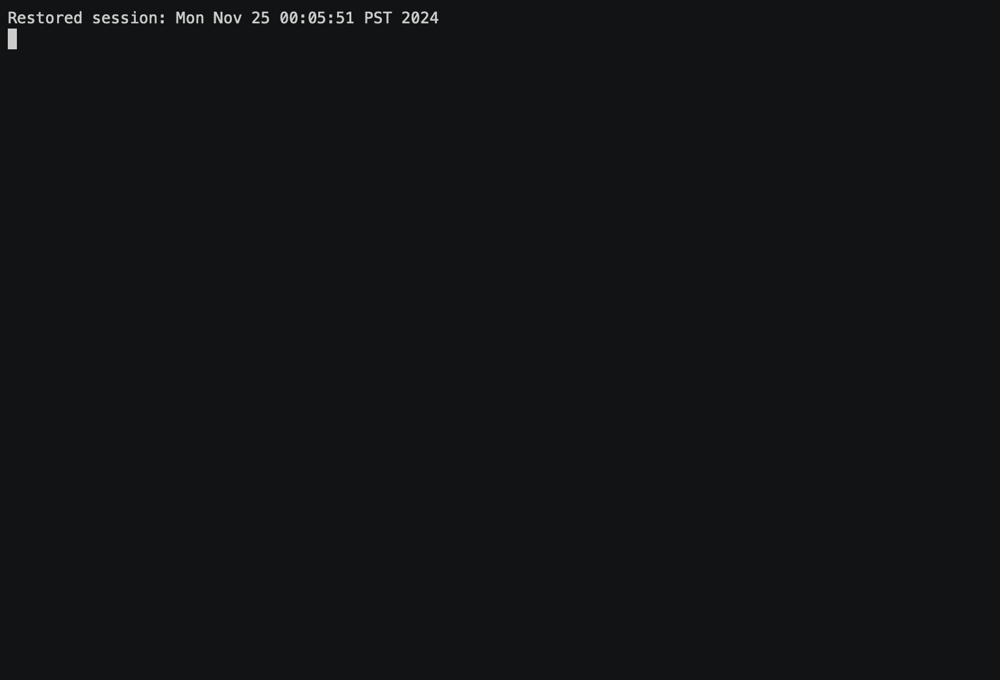

# BlueSky Shell

Never leave your shell! Check-in on BlueSky or automate using BlueSky Shell.

## Introduction

BlueSky Shell is a command-line interface (CLI) tool that allows you to interact with BlueSky directly from your terminal. You can check your feed, post updates, reply to posts, and more without leaving your shell.

## Prerequisites

- Python 3.10 or higher

## Installation

- Using pip:
  ```sh
  pip install bskyshell
  ```
- Using pipx
  ```sh
  pipx install bskyshell
  ```

## Usage



- Open the application

  ```sh
  bsky
  ```

- Post an update
  ```sh
  bsky post
  ```

## Configuration

You can configure BlueSky Shell using environment variables or a .env file. The following variables are supported:

BLUESKY_HANDLE: Your BlueSky handle.
BLUESKY_PASSWORD: Your BlueSky App password (acts like API token).

## Contributing

Contributions are welcome!

## License

This project is licensed under the [MIT License](LICENSE).
